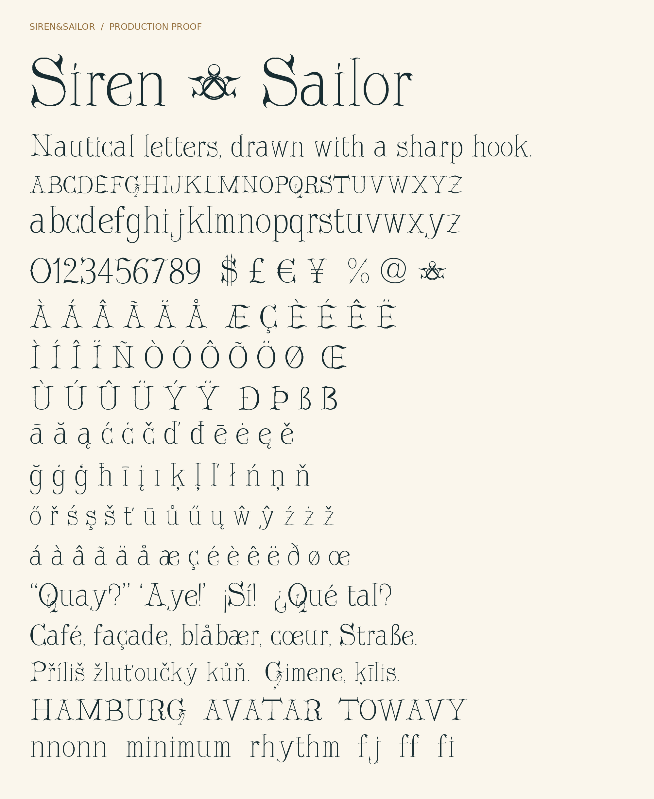

# Siren and Sailor

**Siren&Sailor** is a nautical display serif designed by **Jean-Marc Dykes**. Its swept serifs, sharp hooks, barbs and stroke contrast come from the designer's original lettering and detailed revisions. The font-menu family is **Siren and Sailor** for Google Fonts naming compatibility.



This is a **1.000 submission candidate for owner review**, not an accepted Google Fonts family. The owner applied SIL OFL 1.1 and submitted the individual Google CLA. The source, binary and license now refer to `https://github.com/SkylarkingMonkey/Siren-and-Sailor-Font`. Public repository visibility, final design review and Google submission remain to be completed. See `documentation/RELEASE-DECISIONS.md` and `qa/READINESS.md`.

## Included

- `fonts/ttf/SirenandSailor-Regular.ttf`: installable Regular font.
- `fonts/woff2/SirenandSailor-Regular.woff2`: web font.
- `sources/SirenandSailor-Regular.ufo`: editable cubic master with components, anchors, kerning and features.
- `proofs/SirenAndSailor-Type-Tester.html`: self-contained offline tester and review font download.
- `proofs/SirenAndSailor-Symbols.png`: close-up of the double-harpoon dollar, barbed percent, asterisk, parentheses and number sign.
- `proofs/SirenandSailor-Specimen.png` and `SirenandSailor-Glyphs.png`: rendered proofs of the actual compiled font.
- `qa/`: actual Fontspector 1.8.0 reports, coverage/shaping/metrics validation, spacing audit and reproducibility evidence.
- `googlefonts/ofl/sirenandsailor/`: rebuilt binary, OFL and description in Google's family-folder layout.
- `documentation/`: release notes, submission issue draft, and a separate catalog metadata template.
- `upstream/glyph-construction.json`: exact approved original cubic source. Normal builds do not retrace images.

## Coverage and behavior

352 glyphs, 338 encoded characters, including all **319 Unicode entries in GF Latin Core** (glyphsets 1.1.3), additional accents, dotted circle, separators and rupee. The default digits are proportional; `tnum` activates ten equal-width alternatives. Zero retains the exact capital O drawing, as requested, but has its own semantic glyph. Curly quotes are distinct opening/closing forms. `ccmp`, `kern`, `mark` and `mkmk` handle accent shaping and positioning.

Best suited to titles, covers, packaging, signage and other display settings. This is a single Regular design, not a text family with bold/italic styles. Unhinted outlines use smoothing metadata; very small sizes are not the intended use.

## Install and review

Open the TTF in Font Book or your operating system's font manager. Choose **Siren and Sailor** in an application. The previous **Siren&Sailor** draft has a different menu name and can coexist. The offline tester needs no installation or network connection.

Review the new accented letters, symbols and extended Latin forms before making the repository public. Passing technical checks does not imply Google's design acceptance.

## Rebuild the delivered font

Use Python 3.12 and an isolated environment:

```sh
python -m venv .venv
. .venv/bin/activate
python -m pip install -r requirements.txt
python scripts/build.py
```

On Windows, activate `.venv\Scripts\activate` instead. The build compiles the saved UFO directly with Fontmake, unions overlaps, cleans quantization duplicates, sets production tables and emits TTF/WOFF2. Fixed timestamps make the result deterministic; the supplied environment rebuilt the TTF byte-for-byte.

The `.ufo` is the authoritative editable master. `scripts/prepare_sources.py`, `import_original.py`, `diacritics.py`, `extended_letters.py` and `symbols.py` record how this candidate was prepared from the approved artwork. They are not part of the normal build and must not be rerun over later manual edits or finalized licensing metadata.

## QA

Install the optional QA dependencies with `python -m pip install -r requirements-qa.txt`. Then:

```sh
python scripts/validate.py
python scripts/spacing_check.py
python scripts/proof.py
python scripts/make_tester.py
python scripts/symbols_proof.py
python scripts/package.py
fontspector -p googlefonts -l warn --full-lists --timeout 15 \
  --json qa/fontspector.json --ghmarkdown qa/fontspector.md --html qa/fontspector.html \
  googlefonts/ofl/sirenandsailor/*
```

Fontspector is a separate executable. The tested version is 1.8.0, from https://github.com/fonttools/fontspector/releases/tag/fontspector-v1.8.0 . Download provenance is in `qa/fontspector-tool.json`. The binary is not bundled.

The rebuilt release has no Fontspector FAILs, but the external family-name check returned an ERROR because this environment could not access namecheck.fontdata.com. Review the five warnings and rerun the name check on your Mac. Catalog-only metadata checks are inapplicable until a real METADATA.pb is created at intake; the undated draft is stored as `documentation/METADATA.pb.in`.

## Finalizing a public release

OFL 1.1 was applied with `scripts/finalize_release.py` using the upstream repository URL, and the binary was rebuilt. That script does not publish or verify repository visibility. Review the submitted files and current QA, then make the upstream repository public before filing the Google Fonts issue.

Only provide `--catalog-date` when the actual Google catalog date is known; the initial upstream submission issue does not require catalog metadata. Keep the submitted source and binaries at the same reviewed revision.
